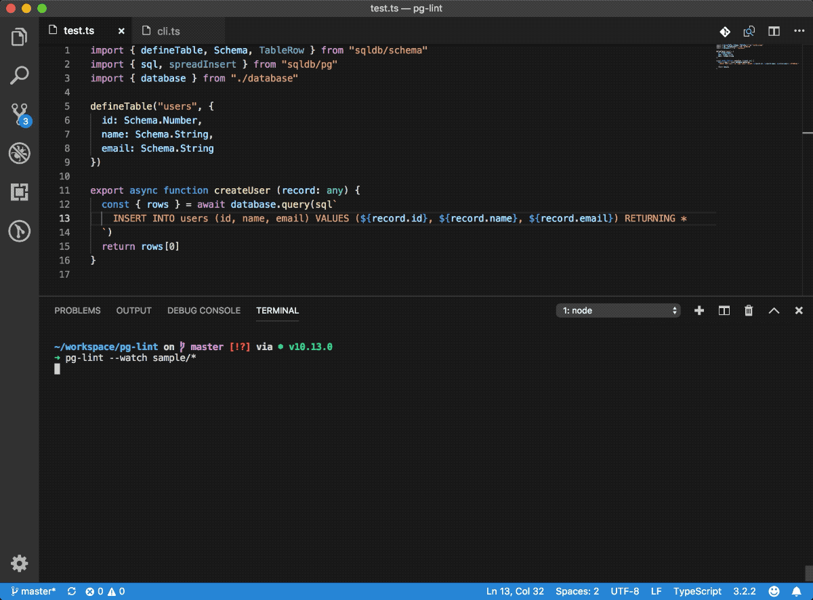

<h1 align="center">postguard</h1>

<p align="center">
  <b>Validate SQL queries in JavaScript and TypeScript code against your schema at build time 🚀</b>
</p>

<p align="center">
  <a href="https://travis-ci.org/andywer/postguard"></a>
  <a href="https://www.npmjs.com/package/postguard"></a>
</p>

<br />

Locates SQL template strings and schema definitions in your code. Evaluates the queries, matching them against your database schema. Supports type-checking via TypeScript, so you get **statically typed SQL queries validated against your database schema** 😱😱

Use with [squid](https://github.com/andywer/squid). It provides SQL tagged template strings, auto-escapes dynamic expressions to prevent SQL injections and comes with some syntactic sugar to write short, explicit SQL queries.

🦄&nbsp;&nbsp;Validates SQL template strings in code<br />
🚀&nbsp;&nbsp;Checks SQL queries [syntax and semantics](#validations)<br />
⚡️&nbsp;&nbsp;Works statically, without additional runtime overhead<br />
⚙️&nbsp;&nbsp;Built on top of Babel & TypeScript<br />
🛠&nbsp;&nbsp;Uses `libpg_query`, the actual Postgres SQL parser<br />

---

<br />

<p align="center">
  
</p>

## Installation

```sh
npm install --save-dev postguard

# or using yarn:
yarn add --dev postguard
```

## CLI

Run the tool like this:

```sh
postguard src/models/*
```

We can use npm's [npx tool](https://blog.npmjs.org/post/162869356040/introducing-npx-an-npm-package-runner) to run the locally installed package:

```sh
npx postguard src/models/*
```

## Command line options

```
Usage
  $ postguard ./path/to/source/*.ts

Options
  --help        Print this help
  -w, --watch   Watch files and re-evaluate on change
```

## Guide

- **[Usage](./docs/usage.md)** - Hands-on examples how to use the tool
- **[Validations](./docs/validations.md)** - List of validations that will be performed

## Motivation

Let's quickly compare the options you got when writing code that uses a relational database.

Our sample use case is updating project rows that are owned by a certain user.

### Plain SQL

Sample:

<!-- prettier-ignore-start -->
```js
const { rows } = await database.query(`
  UPDATE projects SET
    last_opened = NOW(),
    open_count = open_count + 1
  WHERE
    projects.id IN (
      SELECT project_id FROM project_members WHERE user_id = $1
    )
  RETURNING *
`,
  [ userId ]
)
```
<!-- prettier-ignore-end -->

Pro:

- Efficient queries
- Explicit - No magic, full control
- Functional stateless data flow, atomic updates

Con:

- Very easy to make mistakes
- No way of telling if correct unless code is run
- Can be quite verbose
- Requires knowledge about SQL & your database
- No type safety

### ORMs (Sequelize, TypeORM, ...)

Sample:

```js
// (Model definitions not included)

const user = await User.findById(userId)
const projects = await user.getProjects()

const updatedProjects = await Promise.all(
  projects.map(async project => {
    project.last_opened = new Date(Date.now())
    project.open_count++
    return project.save()
  })
)
```

Pro:

- Easy to get started
- Type-safety
- Less error-prone than writing raw SQL
- Requires no SQL knowledge

Con:

- Implicit - Actual database queries barely visible
- Usually leads to inefficient queries
- Update operations based on potentially stale local data
- Virtually limits you to a primitive subset of your database's features

### Query builder (Knex.js, Prisma, ...)

Sample:

```js
// (Model definitions not included)

const usersProjects = await prisma.user({ id: userId }).projects()

const updatedProjects = await Promise.all(
  projects.map(project =>
    prisma.updateProject({
      data: {
        last_opened: new Date(Date.now()),
        open_count: project.open_count + 1
      },
      where: {
        id: project.id
      }
    })
  )
)
```

Pro:

- Explicit - Full control over queries
- Functional stateless data flow
- Type-safety

Con:

- Additional abstraction layer with its own API
- Atomic updates still hardly possible
- Requires knowledge about both, SQL & your database plus the query builder API

### SQL with squid & postguard 🚀

Sample:

```ts
// (Schema definition not included)

const { rows } = await database.query<ProjectRecord>(sql`
  UPDATE projects SET
    last_opened = NOW(),
    open_count = open_count + 1
  WHERE
    projects.id IN (
      SELECT project_id FROM project_members WHERE user_id = ${userId}
    )
  RETURNING *
`)
```

Pro:

- Explicit - Full control, no implicit magic
- Fast due to absence of abstraction layers
- Functional stateless data flow, atomic updates
- Full query validation at build time
- Type-safety

Con:

- Requires knowledge about SQL & your database

## Debugging

Set the environment variable `DEBUG` to `postguard:*` to enable debug logging. You can also narrow debug logging down by setting `DEBUG` to `postguard:table` or `postguard:query`, for instance.

## Questions? Feedback?

Feedback is welcome, as always. Feel free to comment what's on your mind 👉 [here](https://github.com/andywer/postguard/issues/1).

## License

MIT
